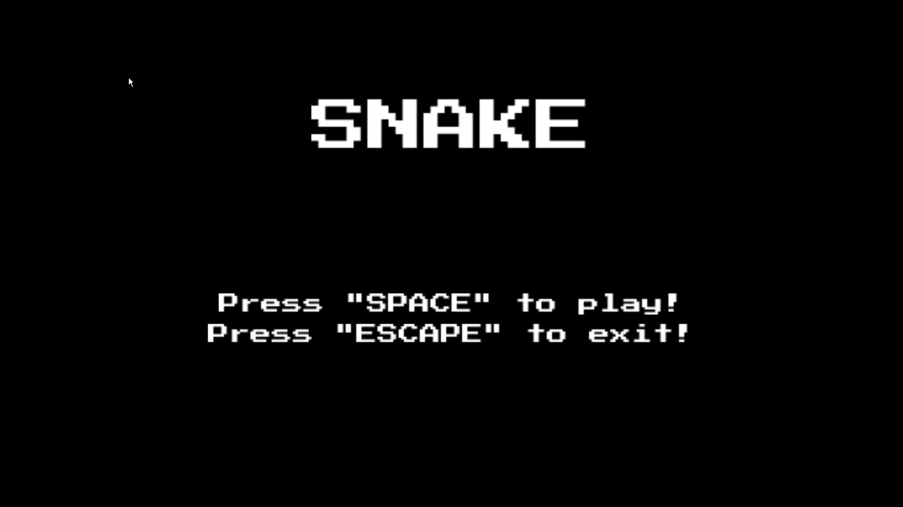
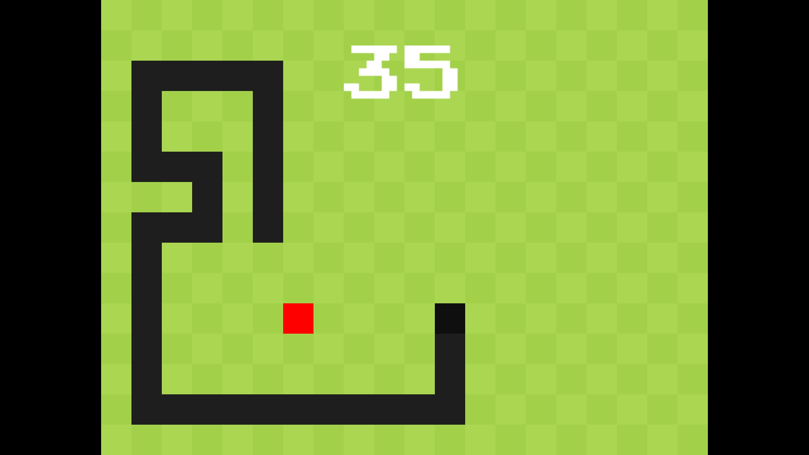
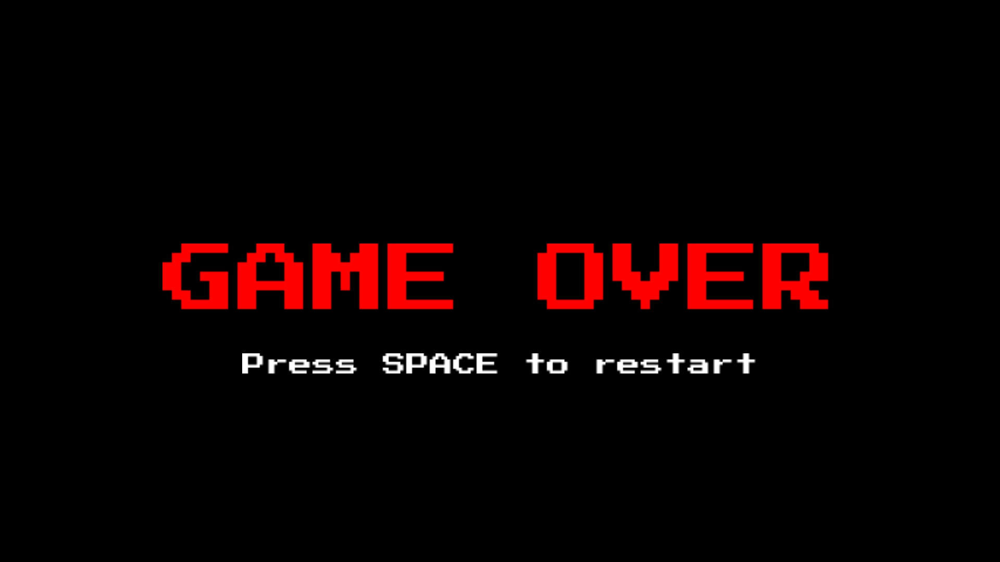

# Snake Game

A classic Snake game implementation in **C** using **SDL3**, featuring retro-style graphics and smooth gameplay.

## Features

- **Classic Snake Gameplay**: Control a growing snake to eat apples and avoid collisions
- **Retro Graphics**: 640x480 resolution with a tiled, retro-inspired visual style
- **Smooth Controls**: WASD or arrow key movement with collision prevention
- **Score Tracking**: Real-time score display as you collect apples
- **Fullscreen Experience**: Runs in fullscreen with letterbox scaling
- **Game States**: Menu, gameplay, and game over screens
- **Smart Apple Spawning**: Apples never spawn inside the snake's body

## Future
- **Sounds effects & music**: I plan to add SDL3_mixer for sound effects and music, for better user experience
- **Difficulties**: Bigger and smaller boards... faster and slower snake... etc!
- **And much more!**

## Controls

### Menu
- **SPACE**: Start the game
- **ESCAPE**: Exit the game

### Gameplay
- **W / UP ARROW**: Move up
- **S / DOWN ARROW**: Move down
- **A / LEFT ARROW**: Move left
- **D / RIGHT ARROW**: Move right
- **ESCAPE**: Exit the game

### Game Over
- **SPACE**: Restart the game

## Screenshots




## Requirements

- **SDL3**: Main graphics and input library
- **SDL3_ttf**: Text rendering library
- **C Compiler**: GCC, Clang, or MSVC
- **Font File**: TTF font file for text rendering

## Building

### Prerequisites

Make sure you have SDL3 and SDL3_ttf installed on your system:

```bash
# Ubuntu/Debian
sudo apt-get install libsdl3-dev libsdl3-ttf-dev

# macOS (with Homebrew)
brew install sdl3 sdl3_ttf

# Windows
# Download SDL3 development libraries from libsdl.org